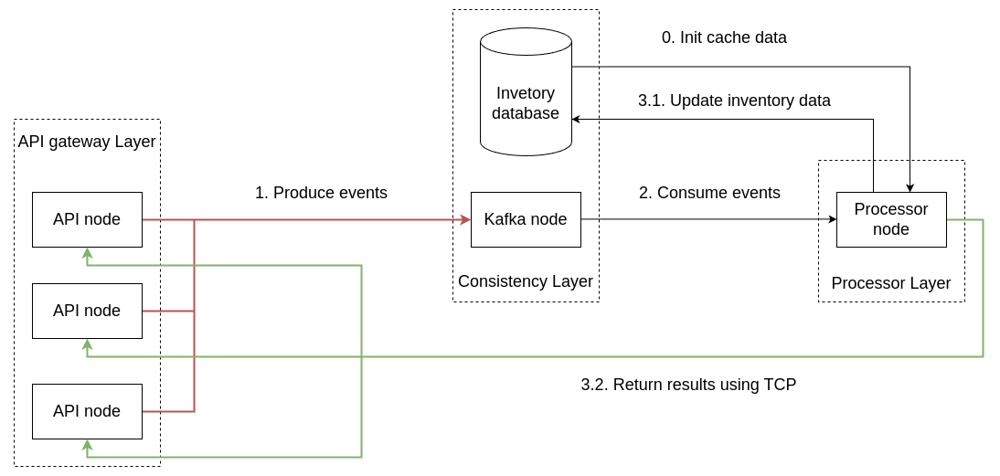
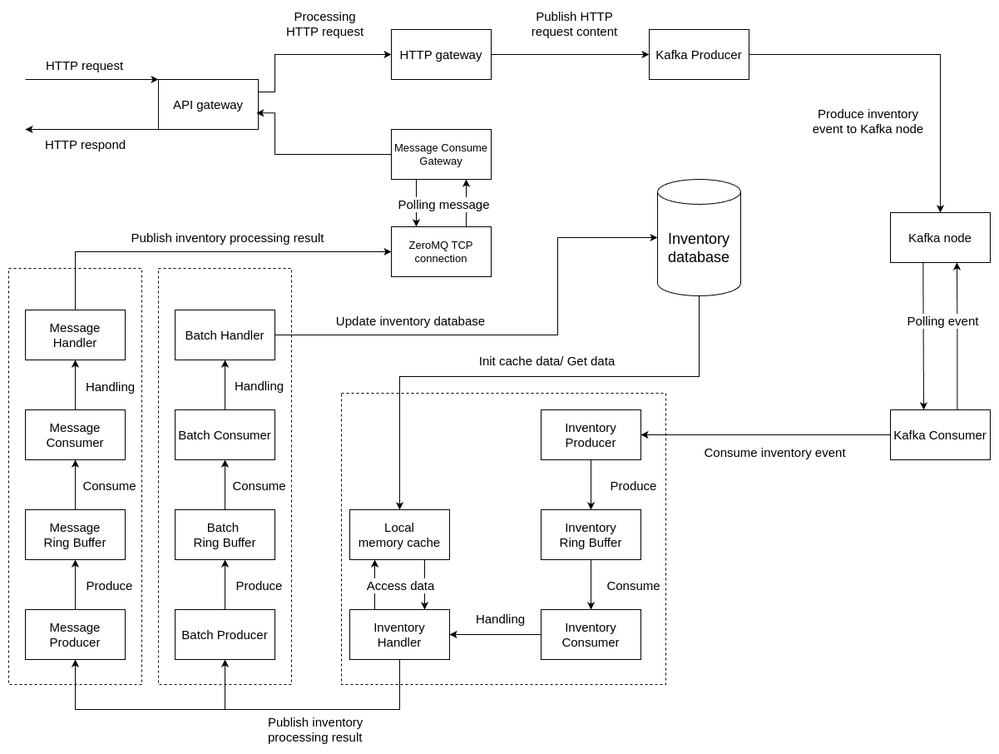
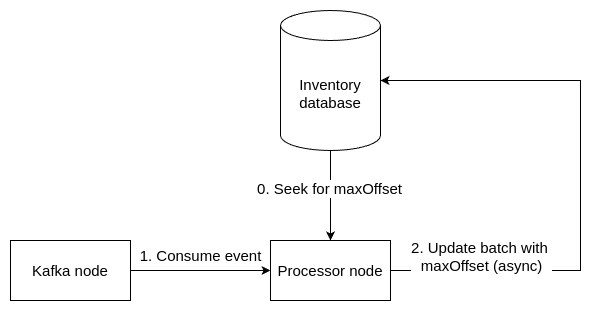

# What is this project ?

This project is my graduation thesis. It's a system to handle inventory data, so that i called it "invensys". This
system listen for a inventory data handling request, check the inventory data, then respond message. If the inventory of
SKUs is enough, send "RESERVED", but if one SKU inventory is not, return that SKU ID and handling next order.

# Problem

The "Single-item Sales Problem" is a fundamental issue in inventory data processing where a single product is contested
by multiple buyers. During flash sale events, e-commerce systems must handle a large number of simultaneous order
requests, leading to the risk of overselling. In addition to processing orders, inventory data is also updated by the
warehouse system. Therefore, ensuring the reliability, consistency of inventory data and handling large traffic are
crucial. Current solutions such as using job queues, locking mechanisms, and multi-threading in programming, as well as
implementing distributed databases with load balancing, have been applied to address this problem. However, these
solutions have not fully utilized the capabilities of the hardware, resulting in increased costs for system upgrades and
expansion.

# Solution

Now in your thinking, you might immediately think about lock and queue job.
This project will show you a "Mechanical Sympathy" thinking, where you see lock and queue job is costing so much. You
read about it at [LMAX Disruptor technical paper](https://lmax-exchange.github.io/disruptor/disruptor.html).

Or you can think about multi-threading programming. When handling orders, you must guarantee the sequence of orders,
which make multi-threading programming not so good here. My solution is still using multi-thread, but not
multi-threading programing. Instead of having a job is handled by a thread and millions of jobs are handled by millions
of threads, you can divide work into stages, and a stage is handle by a specified number of threads. This is called "
Staged Event-driven Architecture" - SEDA.

Finally, caching. Using local cache to handling inventory, latency is reduced. You can update database after handling is
done.

# Contribution

This project focuses on researching, designing, and building a high-load inventory data processing system that reduces
hardware costs and ensures high performance. The system can scale flexibly during peak load times. In testing
environments, the system can sequentially handle 1,000 to 1,500 requests per second with modest hardware configurations.
This system has been successfully tested in a simulated environment, demonstrating stable and efficient operation.

The performance test is done on my personal laptop, with a Ryzen 7 4800H CPU, 8 cores, 16GB RAM, Ubuntu 20.04, Java 17.

# Technology

1. LMAX Disruptor - Handling order in sequence
2. Apache Kafka - Message broker, transactions log, command queue
3. Java 17 - Core programming language
4. Google Guava Cache - Caching
5. Gridgo - Async I/O
6. ZeroMQ - Message Queue, fast results return
7. MySQL - Database

# Architecture

1. Stage Event-driven Architecture
2. Multi-node model

# Design

## Overview: System structural flow diagram


Applying the SEDA staged event-driven architecture and multi-node model, the system is divided into many nodes divided
into different layers, each with its own role. The API Gateway layer consists of one or more API nodes that can be
scaled through the elastic scale, responsible for receiving and responding to HTTP requests. The data consistency layer
consists of two nodes: Kafka nodes and MySQL database nodes, corresponding to raw data and processed data. The task of
this layer is to store and manage data. Finally, the processing layer contains processing nodes that
perform the system's operations.

First, the Kafka node is used as a communication mechanism between the I/O node and the processing node. When the event
is sent to the Kafka node (flow 1), the request order is guaranteed. Kafka nodes store events and unprocessed data,
which allows the processing node to recover from failures and continue processing based on data from Kafka. The
architectural flow of the system is depicted in above. The flows (3.1) and (3.2) are numbered as such to indicate that
these two flows can be processed concurrently, to optimize performance and ensure service continuity.

## Detail: System design model diagram


Applying LMAX disruptor and ZeroMQ, this diagram was created.

## Processor node: Recovery model


When the system restarts or crashes, the processor node queries the inventory database to find the current `maxOffset`
value. This `maxOffset` value identifies the latest event that the system successfully processed before the failure
occurred. This ensures that the system can continue processing from the exact position it left off, avoiding
reprocessing of already processed events or dropping unprocessed events.

Once the `maxOffset` is determined, the processor node starts consuming events from the Kafka node. These events contain
inventory processing requests from the system. The processor node will continue processing events from
position `maxOffset + 1` onwards, ensuring that no events are dropped or processed again.

During processing, the processor node will update `maxOffset` for successfully processed event batches. This update
is performed asynchronously to ensure system performance. The new `maxOffset` value will be stored in the inventory
database, ensuring that information about the latest processed event is always updated in a timely manner.

Thanks to this mechanism, the inventory data processing system can recover from failures effectively, ensuring data
continuity and consistency. When the processing node fails and has to be restarted, the system can quickly determine
where to continue processing, minimizing downtime and maintaining service stability. From this, we also determine that
the inventory database needs two tables, a table containing inventory data in the form of key - value and a table
storing the "maxOffset" value.

## Database

1. Inventory table: sku_id - quantity
2. Offset table: id - offset

You can find it in `src/main/java/other/database/migration`. Remember that offset table has only one record, id is '
maxOffset' and that value is offset of handle kafka record.

# How to run this project

## Installation and set up config

1. Run `bash install.sh` to install java and mvn
2. Set up a Apache Kafka cluster (localhost or server)
3. Set up a MySQL cluster (localhost or server)
4. Create config file by copy example config file, change the config variables. You can change all configs but you
   should take care about:
    1. api_gateway.properties:
        1. REPLY_TO
        2. KAFKA_BROKER
    2. database.properties:
        1. DB_HOST
        2. DB_USERNAME
        3. DB_PASSWORD
    3. processor.properties:
        1. KAFKA_BROKER

```
cp config/api_gateway/example.api_gateway.properties config/api_gateway/api_gateway.properties
cp config/database/example.database.properties config/database/database.properties
cp config/processor/example.processor.properties config/processor/processor.properties
```

## Create .jar file

```
mvn clean install
mvn clean package
```

## Init components

1. Create Apache Kakfa topic using `bash bash/kafka_topic_creator.sh`
2. Create database using `bash bash/migration.sh`
3. Seed database data using `bash bash/seeder.sh`

## Run this system

You need to run a processor and (a) API node(s). Using:

1. API node: `bash bash/apigateway.sh`
2. Processor node: `bash bash/processor.sh`

This project API endpoint is `http:[your-ip-here]:8080/inventory` and body content is in JSON format:

```
{
    "type": "order",
    "skuList": {
        "9df8a2e0-5a53-43fb-8e61-c72a0093514a": 8,
        "ca47dedd-9dcc-40d4-9cfa-4281d9aa1a2b": 5,
        "5390a427-b62c-4e71-b65a-af2ec417766a": 1,
        "45449410-064c-486f-bc5f-70f0e3e9b93a": 2,
        "f1749e95-03c9-49c5-bc1b-e96caa3bfac9": 3,
        "d1819691-cc30-4738-b0d4-ad147b59724a": 5,
        "38cc4d4a-834b-4130-b854-1491de7905f0": 4,
        "fc33c9af-3bba-4b62-bd68-58b79b19d7bd": 3,
        "447f49a0-4678-413f-be37-36b0339072ae": 5,
        "e2213691-18ae-446c-bfc4-a255920fc17e": 1
    }
}
```

'type' is 'order', 'insert', 'update', 'delete', 'rollback'.
'skuList' is the list contain inventory data you want to change, base on 'type', results are different. When 'type' is '
delete', you should set all the quantity of SKUs to 0 or not the request catch a exception.

# Performance test

The performance test is done on my personal laptop, with a Ryzen 7 4800H CPU, 8 cores, 16GB RAM, Ubuntu 20.04, Java 17.

## Create test data

Run `bash bash/test_data_generator.sh`. The test data is `src/main/java/other/performance_test/test_data/json_data.csv`.
You can use this csv file wrk and Apache JMeter.

## Using wrk for performance test

| ID    | Number of Threads | Number of Connections | Run Time (s) | Number of Requests | Average Latency (ms) | Stdev (%) | Throughput (ops) |
|-------|-------------------|-----------------------|--------------|--------------------|----------------------|-----------|------------------|
| wrk-1 | 4                 | 120                   | 40           | 58813              | 31.57                | 96.31     | 1468.14          |
| wrk-2 | 6                 | 180                   | 40           | 94104              | 40                   | 94.62     | 2349.17          |
| wrk-3 | 8                 | 240                   | 60           | 71366              | 46.03                | 93.88     | 1187.90          |
| wrk-4 | 12                | 300                   | 90           | 104174             | 49.89                | 93.95     | 1156.29          |

How to use wrk for testing:

1. Download wrk tool ```sudo apt install wrk```
2. Download LuaRocks to install lua library: ```sudo apt install luarocks```
3. Download ```luasocket``` to for a precise time counter : ```luarocks install luasocket```
4. Change parameters that you want and run test
   at [wrk_test.sh](src/main/java/other/performance_test/wrk_test.sh)

## Using Apache JMeter

| ID   | Number of Threads (users) | Ramp-up Period (s) | Number of Iterations | Average | Median | Std. Dev. | Throughput (ops) |
|------|---------------------------|--------------------|----------------------|---------|--------|-----------|------------------|
| AP-1 | 1000                      | 10                 | 20                   | 63      | 35     | 70.42     | 1990.4           |
| AP-2 | 4000                      | 40                 | 40                   | 2717    | 254    | 11773.46  | 811.6            |
| AP-3 | 8000                      | 200                | 50                   | 3537    | 891    | 7194.06   | 1207.6           |
| AP-4 | 10000                     | 500                | 80                   | 3337    | 684    | 8585.48   | 1143.1           |

The json_data.csv contains 100 records of json body, so using "CSV Data Set Config" in Apache Jmeter.

# What will I continue in the future

Although the inventory data processing system has achieved many important achievements, there are still some limitations
that need to be overcome to improve the efficiency and reliability of the system. First of all, the current system only
has a mechanism to increase the load capacity of the API node, but there is no error recovery mechanism for this node.
This may lead to service interruption when the API node actually has a problem, affecting the user experience.

Second, the use of cache is not optimized. The system has not determined the appropriate cache size when the inventory
database grows larger over time. When there is no data in the cache, the data is still queried directly from the
database, causing unnecessary latency and reducing the overall performance of the system.

Third, ensuring that the production and consumption flow rates of Apache Kafka and the three ring buffers do not differ
too much is a relatively difficult task, requiring repeated testing and fine-tuning to avoid creating unnecessary
bottlenecks.

Finally, although the system has undergone thorough testing, there may still be bottlenecks that have not been detected
during testing. These bottlenecks may affect the system's ability to handle sudden high loads.

These limitations need to be addressed to improve the system's performance and reliability, ensure that the system can
meet increasingly high business requirements and provide the best user experience.


